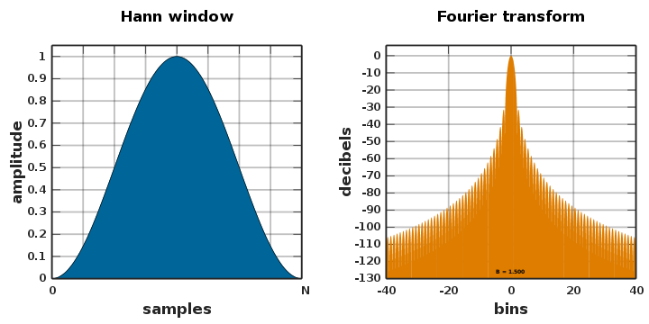

```{r setup, include=FALSE}
knitr::opts_chunk$set(echo = FALSE)
```

Soundcards and transducers can at times produce an audible pop at the onset or offset of a signal. The **Hann window**, AKA hanning or raised cosine filter, is one of many windowing functions that can be applied to account for these distortions. The filter gradually ramps up from 0 amplitude and back down. Applying the window to the onset (on ramp) and offset (off ramp) of a signal gives the transducer some "transition" time to reach full signal amplitude.



---
The wav_maker function generates a range of pure tones from *f0* to *f1*, applies the Hann window to each signal, and saves each signal to a separate .wav file.

```{python, eval=FALSE, echo=TRUE}
import numpy as np
from matplotlib import pyplot as plt
import thinkdsp

def wav_maker(f0, f1, A, d, p, ramp_d):
    """
    creates .wav files of ramped pure tones varying in frequency (f) given:
    
    starting frequncy (f0) in Hz
    last frequency (f1) in Hz
    amplitude (A)
    signal plus ramp total duration (d) in ms
    phase offset (p) in radians
    ramp duration (ramp_d) in ms
    """
    freq_list = [] 
    index = 0
    
    for f in range(f0, f1+1, 1): # create list with all desired frequencies
        freq_list.append(f)
        
        if freq_list[0+index] < f1+1:
            sin_sig = thinkdsp.SinSignal(freq = freq_list[0+index], amp = A, offset = p) # generate sine wave
            index += 1
            
            wave = sin_sig.make_wave(duration = d/1000, framerate=44100) # generate wav file
            
            ramp_samples = 44100*(ramp_d/1000) # generate ramp samples
            window = np.hanning(2*ramp_samples) # hann window is cosine^2 ramp
            w1 = window[:int(len(window)/2)] # use first half of hann function for on ramp
            w2 = window[int(len(window)/2):] # use second half of hann function for off ramp
            w1 = [*w1, *np.ones(len(wave) - len(w1))] # concatenate list with w1 at start, ones thereafter for the duration of the stimulus
            w2 = [*np.ones(len(wave) - len(w2)), *w2] # concatenate list with ones at start, w2 thereafter for the duration of the stimulus
            w1 = np.array(w1)
            w2 = np.array(w2)
            wave.window(w1*w2) # apply on and off ramps to wave
            
            wave.write(filename = str(f) + '.wav')
            wave.plot()

wav_maker(f0 = 1000, f1 = 1000, A = 1.0, d = 15, p = 0, ramp_d = 5) # use function
```

