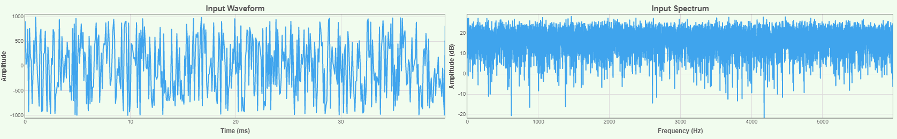

```{r setup, include=FALSE}
knitr::opts_chunk$set(echo = FALSE)
```

White noise is characterized by a flat frequency spectrum. A white noise signal that is infinitely long, in theory, will have equal energy at each frequency. 



---
This script generates a white noise signal at a given sampling rate, low cutoff frequency, high cutoff frequency, and duration. Signal parameters can be adjusted as needed.

```{python, eval=FALSE, echo=TRUE}
import pyaudio
import numpy as np
import matplotlib.pyplot as plt
from scipy.signal import butter, lfilter
from scipy.io.wavfile import write
from scipy import fft, arange

# sample rate and desired cutoff frequencies (in Hz)
fs = 44100
lowcut = 900
highcut = 1100

mean = 0
std = 1
duration=10 # duration in s
num_samples = fs*duration #44100 == 1s

def butter_bandpass(lowcut, highcut, fs, order=5):
    nyq = 0.5 * fs
    low = lowcut / nyq
    high = highcut / nyq
    b, a = butter(order, [low, high], btype='band')
    return b, a

def butter_bandpass_filter(data, lowcut, highcut, fs, order=5):
    b, a = butter_bandpass(lowcut, highcut, fs, order=order)
    y = lfilter(b, a, data)
    return y

def generateAudioStimulus():
    p = pyaudio.PyAudio()
    noise = np.random.normal(mean, std, size=num_samples)
    filtered_noise = butter_bandpass_filter(noise, lowcut, highcut, fs)
    samples = filtered_noise.astype(np.float32).tobytes()
    
    # for paFloat32 sample values must be in range [-1.0, 1.0]    
    stream = p.open(format=pyaudio.paFloat32, channels=1, rate=fs, output=True)

    # write array as .wav
    write('white.wav', fs, filtered_noise)
    
    # listen to the sound
    stream.write(samples)
    stream.stop_stream()
    stream.close()
    p.terminate()
    
    # plot
    t = np.linspace(0, duration, num_samples, endpoint=False)
    plt.plot(t, filtered_noise, label=f'cutoffs: low={lowcut}Hz, high={highcut}Hz')
    plt.xlabel('time (seconds)')
    plt.hlines([-.02, .02], 0, 1/fs, linestyles='--')
    plt.grid(True)
    plt.axis('tight')
    plt.legend(loc='upper left')
    plt.show()
    
generateAudioStimulus()
```

