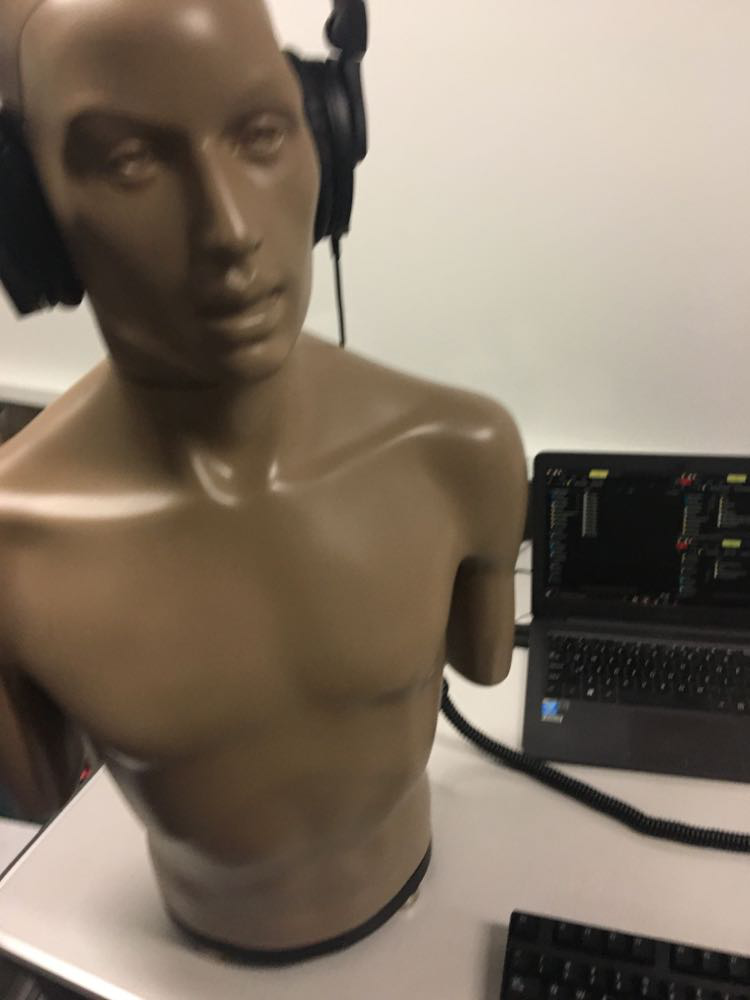

```{r setup, include=FALSE}
knitr::opts_chunk$set(echo = FALSE)

```

```{r, fig.align='left', out.width = "300px"}

```


## bio
I am a researcher in-training at the University of Pittsburgh.

My research interests center on how we learn and process the sounds that we hear.


## trivia
- Despite what this homepage might suggest, I am not a KEMAR.
- The github repository for this website, myomyrus, is named after *Myomyrus rume*, weakly electric elephant-nose fish hailing from South Africa. My research journey started with studying how these creatures learned spatial information.


## contact
lez35[@]pitt.edu
